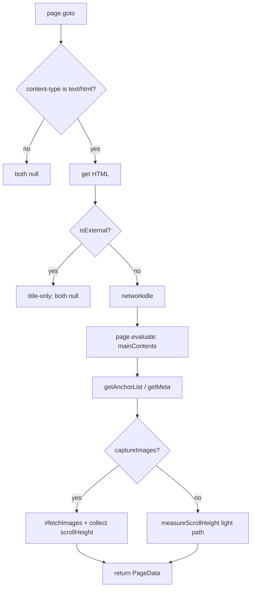

# `@d-zero/beholder`

Puppeteer の `Page` を受け取り、単一ページのメタデータ・リンク・画像・ネットワークリソースに加え、メインコンテンツの定量データと desktop/mobile の `scrollHeight` を収集するインプロセス型スクレイパー。結果は `ScrapeResult` として戻り値で返却される（イベント経由ではない）。ブラウザ管理は呼び出し側の責任。

## Installation

```sh
yarn add @d-zero/beholder
```

## Usage

```ts
import Scraper from '@d-zero/beholder';
import { parseUrl } from '@d-zero/shared/parse-url';
import { launch } from 'puppeteer';

const browser = await launch();
const page = await browser.newPage();

const scraper = new Scraper();
scraper.on('changePhase', (event) => console.log(event.message));

const result = await scraper.scrapeStart(page, parseUrl('https://example.com'), {
	captureImages: true,
	isExternal: false,
});

if (result.type === 'success' && result.pageData) {
	console.log(result.pageData.meta.title);
	console.log(result.pageData.mainContents?.wordCount);
	console.log(result.pageData.scrollHeight);
}
```

設計判断（イベントではなく戻り値で返す理由、`page` のライフサイクル責務、リトライ機構など）は `src/scraper.ts` の JSDoc を参照。

## 取得フロー



## 返却データ（`PageData` の追加分）

- `mainContents`: メイン領域の定量（`wordCount` / `bodyWordCount`、見出し・画像・表・ボタン・iframe / video / audio / canvas の配列、検出した `main` の識別情報）。メイン未検出時もオブジェクトは返り、配列は空・`wordCount` は 0（非 HTML 等で取得しなかったときだけ `null`）
- `scrollHeight`: `{ desktop, mobile }`（各 `number | null`）。未計測時はフィールド全体が `null`
- 配列要素のフィールド詳細は型（`MainContents*` / `ScrollHeightData`）を参照

## console ログ・未捕捉例外の収集

`ScrapeResult.consoleLogs`（`ConsoleLogEntry[]`）に、内部ページ（`isExternal: false`）が出力した `console` メッセージ（全type）と、未捕捉例外・未処理の Promise rejection（`page.on('pageerror')`、`type: 'pageerror'` として区別、スタックトレース付き）が格納される。`resources` と同様に `pageUrl` を持つ戻り値配列で、イベント経由では提供されない。`result.type` が `"success"` / `"skipped"` / `"error"` のいずれであっても常に配列として存在する（該当ログがなければ空配列）ため、エラー発生時のデバッグにもそのまま使える。

```ts
for (const entry of result.consoleLogs) {
	console.log(entry.type, entry.text, entry.args);
}
```

## DOM 文字列からメタ抽出（Puppeteer なし）

HTML 文字列を jsdom などでパースしてから `Meta` を取り出したい場合、`extractMetaFromDocument` を使う。`Scraper` が内部で呼ぶ `collectHead → detectTags → classify` パイプラインと同じ実装を再利用するため、戻り値の `Meta` 形状は `scrapeStart` と同一。DOM ライブラリ（jsdom 等）はユーザランドの責務。

```ts
import { extractMetaFromDocument } from '@d-zero/beholder';
import { JSDOM } from 'jsdom';

const url = 'https://example.com/';
const html = await (await fetch(url)).text();
const dom = new JSDOM(html, { url });

// `as unknown as Window` は jsdom の `DOMWindow` 型が lib.dom の `Window` と
// 構造的に完全一致しないための型キャスト。ランタイムでは互換。
const meta = await extractMetaFromDocument(dom.window as unknown as Window, {
	url,
	html,
});

console.log(meta.title);
console.log(meta.og?.image);
console.log(meta.tags.entries);
```

`context.html` を省略すると `window.document.documentElement.outerHTML` がフォールバックされる。ただし Wappalyzer の HTML パターンはスクリプト実行前の生 HTML に合わせて作られているので、可能なら取得直後の HTML 文字列を明示的に渡す方が検出が安定する。
