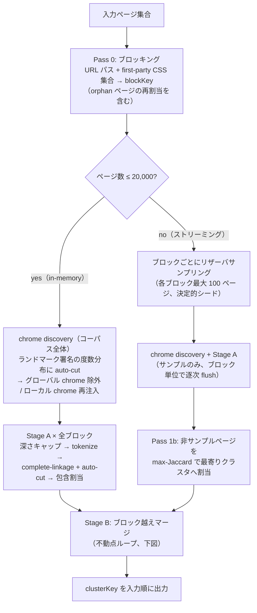
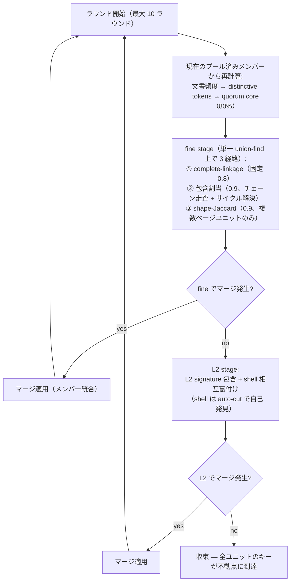

# `@d-zero/page-cluster`

大量クロール HTML の重複・類似ページを構造トークンで検出するパッケージ。HTML ページ集合を受け取って、**同一テンプレートと判定できるページ**に同じクラスタキーを振る。テキストは無視して DOM 構造だけを見るので、本文が違っても同じテンプレートを使うページ群は 1 つのクラスタにまとまる。単一サイトで数万〜十数万ページ規模のクロール成果物を、テンプレート単位に畳んで概観したいときに使う。CLI が主、ライブラリ関数群がオマケ。

## Installation

```sh
yarn add @d-zero/page-cluster
```

インストールすると `page-cluster` コマンドが `node_modules/.bin/` 配下に入る。

## Usage

### CLI

```sh
page-cluster [--content-block-attribute <name>] [--include-landmark-positions] < pages.jsonl > clusters.jsonl
```

**入力**: JSONL 1 行 1 ページ。フィールドは以下。`html` 以外はすべて任意（`paths` / `stylesheetHrefs` がないと粗い分類になる）。

```json
{
	"id": "任意の識別子",
	"html": "<html>...</html>",
	"paths": ["news", "1"],
	"stylesheetHrefs": ["/a.css"],
	"host": "example.com"
}
```

**出力**: JSONL 1 行 1 ページ、入力順。

```json
{ "id": "任意の識別子", "clusterKey": "..." }
```

`--include-landmark-positions` を指定すると、各行に `landmarks` フィールドが追加される。header / footer / nav / aside / form / search / main のインスタンスごとに、HTML 内の位置（1-based の line/column と文字列オフセットの両方）を返す。header 〜 search の 6 種は追加で、そのページが属する最終クラスタ内での頻度分析（`shellQuorum`）に基づく `isChrome`（サイト/セクション共通の chrome か、ページ固有のコンテンツか）を持つ。`main` は常にコンテンツなので `isChrome` を持たない。

```json
{
	"id": "任意の識別子",
	"clusterKey": "...",
	"landmarks": {
		"header": [
			{
				"startLine": 1,
				"startColumn": 7,
				"endLine": 1,
				"endColumn": 30,
				"startOffset": 6,
				"endOffset": 29,
				"isChrome": true
			}
		],
		"footer": [],
		"nav": [],
		"aside": [],
		"form": [],
		"search": [],
		"main": [
			{
				"startLine": 2,
				"startColumn": 1,
				"endLine": 10,
				"endColumn": 8,
				"startOffset": 40,
				"endOffset": 120
			}
		]
	}
}
```

20,000 ページを超えるコーパス（ストリーミング経路）では `--include-landmark-positions` は使えない（エラーで終了する）。ストリーミング経路はリザーバサンプリングと近似割当を使うため、ページ単位の chrome 判定に必要な「そのページが属する最終クラスタの shell トークン」という概念を持たないため。

クローラ出力が JSON 配列の場合は `jq` で line-delimited に変換して食わせる:

```sh
jq -c '.[]' crawl-output.json | page-cluster > clusters.jsonl
```

#### オプション

- `--content-block-attribute <name>` — CMS が自由編集コンテンツブロックに付与している属性名（例: `data-bgb`）が分かっている場合に指定する。指定すると比較前にその属性を持つ要素配下を無視するので、同じテンプレートで本文構成だけ違うページを混同しなくなる。唯一の site-specific なオプションで、未指定でも `<main>` / `role="main"` を起点にした自動深さキャップが常時働く（詳細は `resolve-page-cluster-keys.ts` の JSDoc を参照）
- `--include-landmark-positions` — 出力の各行に上記の `landmarks` フィールドを追加する。20,000 ページ超のコーパスでは使えない。指定すると進捗表示（後述）は出なくなる（進捗を出さない非ストリーミング経路に常に振り分けられるため）
- `--help` / `-h` — ヘルプを表示する
- `--version` / `-v` — バージョンを表示する

#### 進捗表示

処理中は stderr に進捗を出す。stdout の JSONL 出力は影響を受けない。

**対話端末（TTY）**: アニメーション付きの単一ヘッダー行が in-place に書き換わり、現在のフェーズ・進捗・経過時間を表示する。

```
🌏 page-cluster — clustering 12/47 blocks (elapsed 23s)
```

**非 TTY（パイプ・ファイルリダイレクト・CI）**: `[page-cluster] ...` 形式の行を追記する。`pass0:` / `pass1:` / `pass1b:` / `stage-b:` の phase トークンを含むので `grep` / `awk` 互換。

```
[page-cluster] reading input pages...
[page-cluster] read 10000 pages, clustering...
[page-cluster] pass0: 10000 pages read
[page-cluster] pass1: clustered block 12/47
[page-cluster] pass1b: 30000/70000 pages assigned
[page-cluster] stage-b: merging 47 units
[page-cluster] done — 10000 pages in 47 clusters (elapsed 87s)
```

silence したい場合は `2>/dev/null`。ログに残したい場合は `2> progress.log`。

### Library

サブパスエクスポート構成。import パスと提供関数の対応は以下。

| import パス                                          | 提供関数                                                                                                                                                                                                                                                                                                                          |
| ---------------------------------------------------- | --------------------------------------------------------------------------------------------------------------------------------------------------------------------------------------------------------------------------------------------------------------------------------------------------------------------------------- |
| `@d-zero/page-cluster`                               | `tokenize` — `<body>` 配下を構造トークン列に変換する低レベルプリミティブ                                                                                                                                                                                                                                                          |
| `@d-zero/page-cluster/resolve-page-cluster-keys`     | `resolvePageClusterKeys`（非同期・ファクトリ入力・メモリ有界のメインエントリー）、`resolvePageClusterKeysFromArray`（array 入力ラッパー）、`resolvePageClusterKeysInMemory`（同期・array 入力）。いずれも `includeLandmarkPositions: true` を渡すと `clusterKey` に加えて位置情報つきの `landmarks`（`PageLandmarkReport`）を返す |
| `@d-zero/page-cluster/extract-landmarks`             | `extractLandmarks` — header / footer / nav / aside / form / search / main の 7 種を抽出し、インスタンスごとの生 HTML と HTML 内の位置（line/column・文字列オフセット）を返す                                                                                                                                                      |
| `@d-zero/page-cluster/resolve-landmark-variant-keys` | `resolveLandmarkVariantKeys` — 特定ランドマークのデザインバリアントでページを分類                                                                                                                                                                                                                                                 |

```ts
import { resolvePageClusterKeysFromArray } from '@d-zero/page-cluster/resolve-page-cluster-keys';

const keys = await resolvePageClusterKeysFromArray([
	{
		paths: ['news', '1'],
		stylesheetHrefs: ['/a.css'],
		html: '<body><article>one</article></body>',
	},
	{
		paths: ['news', '2'],
		stylesheetHrefs: ['/a.css'],
		html: '<body><article>two</article></body>',
	},
	{
		paths: ['about'],
		stylesheetHrefs: ['/a.css'],
		html: '<body><section>about</section></body>',
	},
]);
// keys[0] === keys[1]（同一テンプレート）、keys[2] は別クラスタ
```

オプション・型・設計判断の WHY はすべて各関数の JSDoc に記載している。CLI 経由で十分な場合は読み飛ばして OK。

## アルゴリズム概観

`clusterKey` がどう決まるかを知っておくと、出力の解釈（なぜこの 2 ページが同じキーなのか）とオプションの選択がしやすくなる。実装詳細の WHY は各ソースファイルの JSDoc が正。

### 全体パイプライン



- **Pass 0（ブロッキング）** — HTML を読まず、URL パスと first-party stylesheet 集合だけで粗く分割する。高価な構造比較を同一ブロック内に閉じ込め、コーパス全体の比較コストを O(n²) から劇的に減らす。stylesheet を持たない orphan ページは同一セクションの CSS ブロックへ再割当される
- **chrome discovery** — 全ページのランドマーク署名の度数分布に auto-cut を当て、閾値以上を「グローバル chrome」（サイト共通のヘッダー等）として比較から除外し、閾値未満かつ 2 ページ以上に出現するものを「ローカル chrome」（セクション固有のナビ等）としてトークン再注入する
- **Stage A（ブロック内クラスタリング）** — ブロックごとに直線的な処理。`<main>` の深さキャップ（候補深度を全走査して knee を探す自動選択）→ tokenize → complete-linkage 階層クラスタリング → max-gap auto-cut でカット高を決定 → 最後に包含関係にあるクラスタを吸収する包含割当（割当チェーンを辿り、循環はメンバー最大のクラスタをルートに選んで解決）
- **Pass 1b（ストリーミング時のみ）** — 20,000 ページ超では各ブロックをリザーバサンプリング（最大 100 ページ、ブロックキーをシードにした決定的乱数）で代表させ、サンプル外のページは Stage A 完了後に max-Jaccard で最寄りクラスタへ一括割当する。メモリ使用量はコーパス全体ではなくサンプルサイズに比例する
- **Stage B（ブロック越えマージ）** — ブロック分割はあくまで比較コスト削減のためなので、最後に同一テンプレートがブロックを跨いで分かれていないか再統合する。これが唯一の反復処理（次節）

### Stage B: ブロック越え統合の不動点ループ



マージが起きるとユニットのメンバー構成が変わり、文書頻度も quorum core も変わる。そのため毎ラウンド、統合後のプールから全指標を**再計算**してマージを再試行する。fine stage・L2 stage の両方でマージが 1 件も出なくなった時点で不動点に到達したとみなして収束する（安全弁として最大 10 ラウンド。実データでは 7 ラウンド以内に収束）。L2 stage は fine stage が空振りしたラウンドでしか実行されない最後の粗い経路で、誤マージ防止のために shell（ランドマーク由来トークン）の相互裏付けを要求する。

### Self-tuning

閾値の多くは **max-gap auto-cut**（度数分布の隣接ギャップ最大の中点を境界とする）でデータから自己発見される。① Stage A のカット高、② Stage B の shell 判定、③ chrome discovery のグローバル/ローカル判定、④ Pass 0 の URL パス深さ選択、の 4 箇所で同一プリミティブを再利用しているので、サイトごとにハイパーパラメータをチューニングする必要はない。詳細は `autoCutThreshold` の JSDoc を参照。例外的に Stage B fine stage の complete-linkage だけは固定閾値 0.8 を使う（理由は `merge-cross-block-clusters.ts` の JSDoc を参照）。
